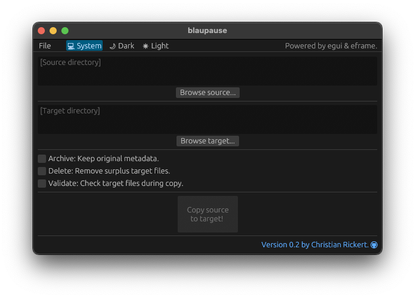

# blaupause 🗂️

_blaupause_ is a minimalistic tool to copy a single directory.

  

Command-line tools like _rsync_ (Linux & macOS) and _ROBOCOPY_ (Windows) provide powerful options for data transfer and duplication. However, achieving specific outcomes often requires frequent reference to documentation or diligent note-taking to recall the correct parameters.

Importantly, incorrect use of options like `--delete` (_rsync_) or `/PURGE` (_ROBOCOPY_) can result in unintended data loss.

_blaupause_ offers a sensible default configuration to optimize transfer speeds and deliver feedback during copy operations — all within a minimalistic, user-friendly interface. Rather than implementing a custom algorithm for data transfer and duplication, _blaupause_ leverages native command-line tools to copy directories and their contents. Progress and completion status are reported in the corresponding Terminal (macOS) or Command Prompt (Windows). On Linux, you need to either start _blaupause_ from the Terminal or from a desktop shortcut with `Terminal=true` set.

```
// rsync on Linux & macOS with default and [custom] options
// https://download.samba.org/pub/rsync/rsync.1
rsync -hrlvPW /source /target [-a --delete-during --checksum]

// ROBOCOPY on Windows with default and [custom] options
// https://learn.microsoft.com/en-us/windows-server/administration/windows-commands/robocopy
ROBOCOPY \\source \\target\source /E /ETA /MT:2 /V [/COPYALL /PURGE]
```
ROBOCOPY does not offer an explicit checksum verification but instead checks transfers by comparing file sizes and timestamps: The 'Validate' option is therefore disabled on Windows.

>[!TIP]
Both _rsync_ and _ROBOCOPY_ support incremental updates: If a transfer is interrupted (e.g., due to connection loss or timeouts), simply rerun the operation to resume and complete it. Unchanged directories/files will be skipped, modified ones will be replaced, and missing items will be added.

>[!CAUTION]
If you enable the delete option (default: unchecked), any directories/files that exist on the target (receiving side) but are missing on the source (sending side) **will be deleted** — effectively synchronizing both directories. If the delete option remains unchecked, existing items on the target **will be updated but never deleted**.

_blaupause_ is built with [egui](https://github.com/emilk/egui) and [eframe](https://github.com/emilk/egui/tree/master/crates/eframe) by Emil Ernerfeldt ([@emilk](https://github.com/emilk)). For licensing details, please refer to the respective copyright notices.
